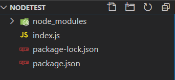
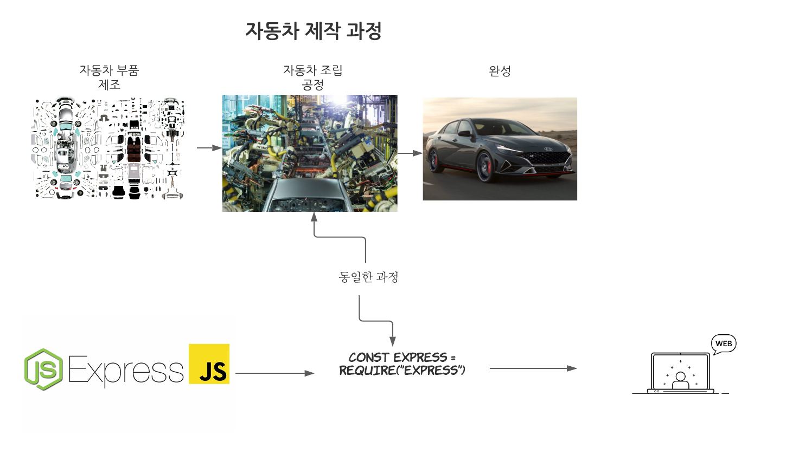
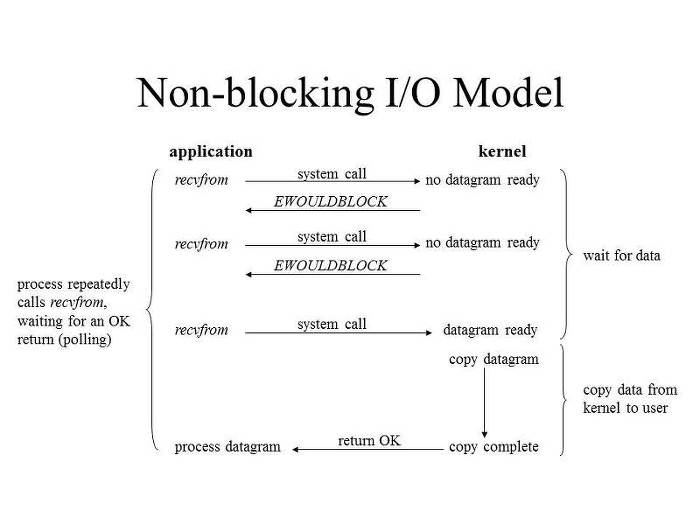
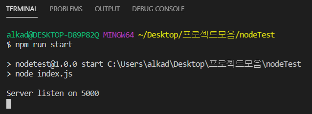
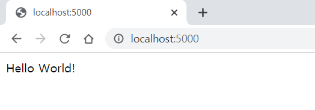
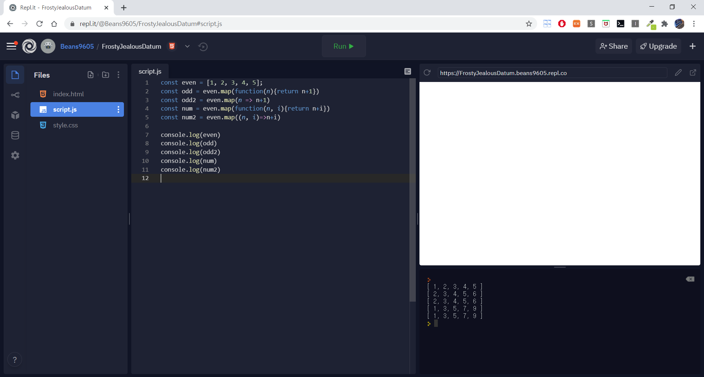

[TOC]

# Node.JS 멋쟁이 사자처럼 강의

강의는 각 주차별로 나뉘고, 매 주 한번씩 업데이트 됩니다.

본 강의는 멋쟁이 사자처럼 경기대학교에서 주관하는 강의입니다.


**강의를 들었을 때 도움이 되는 사람들**

- 웹, 어플리케이션을 만들고 싶으나 기반 지식이 부족한 사람들
- Javascript에 대해 기초 지식이 없는 사람들
  - 있어도 무관
- 비전공자이거나 전공자인데 이론 및 코드 구조에 대해서 이해도가 부족한 사람들


**강의를 들어도 별로 도움 안되는 사람들**

- 이미 node.js, express를 다룰 줄 아는 사람들
- 이론이 별로 궁금하지 않고 코드만 알고 싶은 사람들
- 모든 내용이 전공자 기준으로 세세하게 설명되어있는 자료를 원하는 사람들


시작 일시 2020-09-10

### By 경기대 멋쟁이사자처럼 고영빈


# 비 전공자들을 위한 서버 개발론

## 용어 설명

### 쉽게 이해하자!

1. 용어에 대한 간단한 설명 및 고찰
   - SERVER 
     - 비 전공자가 생각하는 서버를 먼저 알아보도록 하자
       - 첫번째, 서버는 대체 뭘까?
       - 두번째, 서버가 터졌다는건 뭘 의미할까?
     - 서버를 개발하고 싶은 당신 어떻게 해야할까?
       - 첫번째, 개발자의 입장에서 서버의 의미
       - 두번째, 서버를 개발한다는건?
       - 세번째, 배포를 한다는건 어떤걸 의미할까?
   - API (Application Programming Interface) 응용 프로그램 프로그래밍 인터페이스
     - 비 전공자가 생각하는 API를 알아보자
       - 첫번째, 전공자가 주구장창 말하는 API는 쉽게 뭐라고 설명할까?
       - 두번째, API 디자인이 잘못됐다는건 어떤걸 의미하는걸까?
       - 세번째, API를 만들어서, 혹은 가져와서 대체 뭘 할 수 있는걸까?
     - API를 만들어야하는 당신, 혹은 가져와 사용해야하는 당신, 어떻게 해결할까?
       - 첫번째, 해당 언어의 특성
       - 두번째, 가져올 API 혹은 개발해야할 API의 특성
       - 세번째, 알고리즘
   - CLIENT
     - 비 전공자가 생각하는 클라이언트를 알아보자
       - 첫번째, 클라이언트는 게임 받을 때만 썼었는데?
       - 두번째, 서버와 클라이언트는 대체 무슨 차이가 있을까?
       - 세번째, 클라이언트 개발자와 서버 개발자는 어떤 차이가 있을까?
     - 클라이언트 개발을 하고 싶은 당신 어떻게 해야할까?
       - 첫번째, 개발자 입장에서 서버의 의미
       - 두번째, 클라 개발자 어렵나?
       - 세번째, 웹에서는 클라이언트 개발자가 있을까?

## Server

### 비 전공자가 생각하는 서버

#### 서버는 대체 뭘까?

여러분이 생각하는 서버는 어떤걸까요?

![[국가슈퍼컴퓨터 사기극-①]KISTI의 전횡 20년,‘슈퍼컴을 살 수 없는 비극’무너진 學∙硏 연구기반](http://www.pitchone.co.kr/wp-content/uploads/2016/04/슈퍼컴문제1-750x313.jpg)

위 사진과 동일하게 복잡하고 이해하기 어려운 기계들이 나열되어있는걸 먼저 떠올리셨다면,

당신은 누가 생각해도 비전공자입니다.

여러분이 생각하는 서버는 생각보다 어려운 개념이 아닙니다.

그저 여러분이 사용하는 컴퓨터와 동일하다고 생각하시면 되죠, 여러분은 7월부터 8월까지 장고 강의를 들으면서 localhost로써 본인의 컴퓨터를 서버대용으로 사용하고 있었죠.

이렇게 생각하시면 편합니다.


##### 친구들에게 영화 보여주기


집에 영화가 많은 친구가 있습니다.

영화가 보고싶은 여러 친구들은 영화를 보러 가기 위해 친구네 찾아가죠

자전거, 버스, 자가용, 지하철 등 여러 교통 수단을 이용해서 친구네 찾아갑니다.


그러던 와중 영화가 많은 친구는 친구들이 집을 치우지 않고가서

더 이상 집에서 친구들에게 영화를 보여주고 싶지 않아졌습니다.

그래서 자신의 컴퓨터에 서버를 열고 해당 IP 주소를 공개하기로 했죠.


그에 따라서 친구들은 해당 IP를 통해 친구네 집에 있는 컴퓨터 속 영화를 볼 수 있게됩니다.


위 그림처럼 말이죠

서버는 영화 많은 친구네 컴퓨터가 될 것이고, 웹 브라우저 및 중간 다리 역할을 하는 프로그램을 API라고 부르게 됩니다.

그리고 서버에서 영화를 보고싶어하는 친구들은 클라이언트가 됩니다.

**따라서 서버는 우리가 사용하는 컴퓨터와 다를 바가 없습니다.**

다만, 그 컴퓨터의 스펙이 일반적인 컴퓨터보다는 뛰어날 뿐입니다.


#### 서버가 터졌다는건 뭘 의미하는 걸까?

우리의 학창시절을 생각하면, 고등학교 당시에 정말 많은 시간을 공부에 할애했습니다.

어쩌면 자는 시간까지 줄여가며 피나게 공부했었네요. 그러면서 자주 겪는 현상이 있습니다.

사람이 에너지를 너무 과하게 쓰거나, 즉 머리를 너무 많은 지식을 한번에 넣으려고 하면 뇌는 혼란을 겪고 기능을 정지하려 할겁니다.
그 기능의 정지를 저희는 보통 잠이라고 칭하죠.
 잠이 온다는건 지금 내가 에너지를 너무 많이 써서 잠시 뇌를 정리하고 지금까지 받아드렸던 지식들을 정돈하고, 뇌를 재정비한다는 의미죠.

이런 현상이 서버에도 동일하게 존재합니다. 저희가 흔히 수강신청을 하면서 느끼죠.


​																						**※ 삐빅, 이미 수강신청은 망했습니다.**

여러분은 해당 페이지를 얼마나 봤을까요?

크롬 환경에서 서버가 터졌을때나, 혹은 기타 에러가 났을때 뜨는 페이지입니다.

**수강신청 환경은 어떤가요?**

학교에서 제공하는 웹페이지에 접속해서 본인이 원하는 강의를 신청해서 듣는 게, 저희가 알고 있는 수강신청이죠. 하지만 수강신청 환경은 그리 썩 좋은 편은 아닙니다.

상대적으로 학교 홈페이지는 특정한 행사가 있지 않은 이상 딱히 접속할 일이 많이 없죠. 그렇다는 이야기는 평소에 받아드리는 접속자 수가 평균적으로 많지 않다는 이야기고, 그에 따른 서버 비용이 적다는거죠, 즉 서버 컴퓨터를 좋은 걸 쓸 이유가 없다는 겁니다.

그러나 수강신청과 같은 학교 대대적인 행사와 같은 경우는 평소보다 훨씬 더 많은 접속자 수를 받아야합니다.

그렇다면 이 전까지 평균 접속자 수가 적었기 때문에 상대적으로 안좋은(?) 서버를 쓰고 있던 학교 컴퓨터는 두 가지 방안이 있습니다.

하나는 서버를 증설해서 더 많은 접속자 수를 받을 수 있게 만드는겁니다.

또 하나는 원래 쓰던 서버를 그냥 그대로 쓰는겁니다.

자, 둘은 어떤 결과를 나타낼까요?

1. 서버 증설
   - 접속자 수를 서버 증설로 각 서버, 즉, 여러 컴퓨터로 분산해서 받으므로 원활하게 수강신청을 할 수 있게됩니다.
2. 그대로 쓴다.
   - 평소 접속자 수가 100명이고, 최대 수용 접속자가 200명이라고 합시다.
   - 그런데 수강신청 당일날에 접속을 요구하는 사람이 1000명입니다.
   - 일단 서버는 모든 사람을 받기 위해서 모든 사람들에게 데이터를 전송하려 합니다.
   - 하지만, 서버는 이내 한계를 느끼고, 다운되고 맙니다.

2번의 상황을 보고 서버가 터졌다는 말을 하는겁니다.

그렇다면 우리는 서버를 어떻게 디자인해야 2번과 같은 상황에 빠지지 않을까요?


### 서버를 개발하고 싶은 당신 어떻게 해야할까?

#### 개발자의 입장에서 서버의 의미

개발자의 입장에서의 서버는 단순히 데이터를 저장해놓는 공간에 불과합니다. 또한, 서버 API를 보관하고, 사용할 수 있게 만드는 그저 저장 공간에 불과하죠.

그렇다면 서버 개발이라는건 어떤 걸 의미할까요?

딱 꼬집어서 이야기하기에는 어려운 감이 있습니다.

쉽게 이야기하면, **'서버에서 작동해줘야하는 기능'**을 개발하는 거라고 생각하는게 마음 편하겠네요.


#### 서버를 개발한다는 건?

서버의 의미에 대해서 위에서 이야기했습니다. 그렇다면 서버에서 작동해줘야하는 기능은 뭐일까요?

API는 Application Programming Interface라고 해서 응용 프로그램 프로그래밍 인터페이스라고 부르는데, 이는 응용프로그램에서 작동하는 기능의 스케치 상태라고들 많이 이야기합니다. 스케치 상태에서 드로잉을 한다하면 그림이 되겠죠?

API도 마찬가지라고 생각하시면 됩니다. 여러 도안을 받아와서, 내가 원하는 내 입맛대로 적용하면 내가 만든 새로운 기능을 하는 프로그램이 되는겁니다.

서버를 개발한다는건 서버에서 작동해야하는 기능을 서버 API를 통해서 개발을 해나간다는걸 의미합니다.

처음부터 끝까지 본인이 디자인해서 개발하는 방법도 있겠지만, 그런 사람은 엄청난 천재거나, 엄청난 바보겠죠?


#### 배포를 한다는 건 어떤걸 의미할까?

위에서 이야기 했듯이 서버를 배포하는 일은 영화가 보고싶은 친구들을 영화가 많은 친구네로 이동해서 보는 것과 같습니다.


여러분이 서버에서 제공해주고자 하는 서비스가 있다면, 해당 서비스를 서버에 구축한 뒤에 서버에 접근 하기 용이하도록 만들어 주면 됩니다. 서버에 접근할 수 있도록 만들어주는 API를 간단하게 활용해서 말이죠.


가장 쉬운 예시로 filezilla라는 프로그램이 있습니다.

이 프로그램은 내 컴퓨터를 호스트로 만들어서 호스트 IP와 거기에 부여된 유저 이름, 패스워드, 포트번호를 입력하면, 내가 파일질라를 통해서 공유하고자하는 폴더를 이 서버가 계속해서 열려있는동안 언제든지 파일을 공유할 수 있게 만들어주는 프로그램이죠.

즉, 내가 원하고자하는 서비스(공유하고자하는 파일 a.k.a Server)을 API를 통해(FileZilla) 여러 사용자에게 공유(Client)해 줄 수 있게 만드는게 배포의 기본적인 원리이죠.


**※ 파일질라는 여러개의 폴더 및 파일을 연결된 서버에 올리거나 삭제를 가능케한다.**


그렇다면 웹서비스, 즉, 네이버, 구글, 등등의 서비스를 제공하는 경우에는 어떻게 할까요?

위 방법과 크게 다르지 않습니다. 우선 서버에서 제공하는 기능들을 모두 구현한 후에, 클라이언트와 서버를 연결 할 수 있도록 권한을 부여하는 API를 통해서 공유하면 되죠.

보통의 방법으로 공유하게 되면, 여러분의 IP와 DNS를 통해서 접근하게 될겁니다.


**※ IP정보 및 subnet mask**

보시면 아시겠지만 IP정보를 알아내야한다는건 상당히 귀찮은 일이죠. 저 IP 주소를 모두 외워야할 뿐만 아니라 기능 별로 세세하게 주소가 달라지므로 여러분이 이걸 곧이 곧대로 사용한다는건 귀찮은 수준이 아니라, 실 서비스에서는 사용할 수 없을 정도를 의미합니다.

그래서 이러한 IP주소를 여러분들은 도메인이라는 웹서비스 이름을 호스팅 업체로 부터 구매하여 사용할 수 있습니다.

그렇게 되면 좀 더 편하게 접근할 수 있는 것이죠 (ex : www.naver.com, www.google.co.kr ... ).


**※ Django 는 웹서비스 개발을 위한 python 기반 프레임워크, Heroku는 프레임워크를 통해 개발된 서비스를 서버 호스팅을 통해 제공**

7~8월 사이에 여러분이 배운 장고와 헤로쿠는 제가 위에서 설명한 모든걸 포함시킵니다.

(하지만 클라이언트 개발에 대해서는 다루고 있지 않죠, 이것에 대해서는 나중에 React Native를 강의할 때 설명해드리겠습니다.)

장고는 쉽게쉽게 웹서비스를 개발할 수 있게 도와주는 프레임워크입니다. 개발비용이 낮고, 비교적 사용방법이 쉬워서 스타트업 기업이나, 외국계 기업에서 자주 사용하는 프레임 워크죠.

헤로쿠는 이에 아주 걸맞는 서버호스팅 서비스입니다. 헤로쿠가 가지고 있는 서버를 제공하고, 거기에 여타 프레임워크를 통해 만든 서비스를 쉽게 배포할 수 있게 만들어주는 서비스죠. 실제로 해외에서 5위 안에 드는 서버 호스팅 업체입니다.


여기까지가 저희가 배운 내용이였습니다.

그렇다면 노드는 어떨까요?


## Node.JS


#### 핵심 키워드

- 구글 V8 자바스크립트 엔진
- 고성능 네트워크 서버
- 단일 쓰레드(Single Thread) 이벤트 루프(Event Loop) 기반
- 비동기 I/O 처리 (Non-Blocking I/O)
- 자바스크립트
- 개발 생산성 향상
- 발대한 모듈 제공 (NPM)


#### 가장 중요한 특징

Node.js 이전에는 JAVA 기반의 웹 개발자들이 많았습니다. 그래서 그 전 단계의 개발자들은 쓰레드 기반 동기방식에 익숙해져있었는데, 쓰레기 기반 동기방식이라는건, 여러개의 동시 처리가능한 쓰레드를 만들고 요청이 오면 해당 요청을 비워져있는 쓰레드가 받아 실행, 및 response를 보내는 방식, 즉 모든 쓰레드를 사용중이면 I/O는 대기 상태에 머물게 되죠.

이런 개발 방법은 실제로 운영체제와 같은 CPU의 프로세스를 여러갈래로 나누어서, 즉 쓰레드의 형태로 나누어서 개발하는 방법이 많죠, 대신에 운영체제는 좀 더 유연한 형태로 되어있기 때문에 비동기, 동기 상태를 모두 사용할 수 있습니다.

각설하고 그렇다면 **쓰레드 기반 동기방식**, **단일쓰레드 이벤트 루프 기반 비동기 방식**, 이 두 방식의 차이를 정확하게 알아보도록 하죠.


##### 쓰레드 기반 동기방식(Blocking I/O)

전공자 분들은 운영체제 강의를 들으셨다면 어느정도 이해 가능한 수준의 방식입니다.

(필요하시면 제가 운영체제 공부해놓은 것에서 참조해서 가져오겠습니다.)

- 하나의 쓰레드가 request를 받으면 모든 처리가 완료될때까지 기다리다가 처리결과가 완료되면 다시 응답을 보냄
- 기존 업무 처리가 완료되기 전에 또다른 request가 있으면 새로운 쓰레드가 업무를 처리함
- 동시 request가 많은 경우 많은 쓰레드가 필요하게 되어 서버 과부하

##### 단일쓰레드 이벤트 루프 기반 비동기방식(Non-Blocking I/O)

- 하나의 쓰레드가 request를 받으면 바로 다음 처리에 요청을 보내놓고 다른 작업을 처리하다가 먼저 요청한 작업이 끝나면 이벤트를 받아서 응답을 보낸다.
- 동시 request가 오더라도 처리가 완료될때까지 기다리지 않아도 되기 때문에 서버 부하가 적다.


자 여러분 지금 이게 무슨 외계어인가 싶기도 하죠?

전공자 여러분들은 어느정도 감내하고 들을만한 수준의 용어와 설명일겁니다.

그러면 비 전공자 여러분들을 위해 조금 더 쉽게 설명해보겠습니다.


##### 쓰레드 기반 동기방식(Blocking I/O) 설명

자 여러분, 샌드위치 좋아하시나요? 저는 샌드위치를 참 좋아하는데, 그래서 일이 끝나면 간혹 서브웨이에서 샌드위치를 먹습니다.


서브웨이에 가면 가장 먼저 뭘 할까요? 어떤 종류의 속재료를 먹을지 선택을 하죠? 터키, 이탈리안 BLT, 등등 여러가지 메인 속 재료들이 있습니다.

그리고 점원에게 주문을 하고, 빵을 선택한 후에, 치즈를 선택하고, 가열과정을 거쳐, 채소를 선택하고, 마지막으로 소스를 선택하면 주문이 완료되죠.

자 이 과정이 아까 설명한 **쓰레드 기반 동기방식**과 동일합니다. 어떤 부분이 동일한지는 차근차근 설명해 나가면서 알아봅시다.


서브웨이에서는 여러 명의 직원이 존재하죠, 각 직원은 보통 한 사람의 주문을 받습니다. 그리고 해당하는 주문이 모두 완료될 때까지 다른 주문을 받지 못합니다.

그렇다면, 직원이 만약에 세 명 있고, 각 직원 당 받을 수 있는 주문의 수는 1회~2회라고 생각해봅시다.


사람이 적을 때는 문제가 되지 않지만, 점심시간이 되어 많은 사람들이 직장 혹은 학교 등등 각지에서 나와 서브웨이에 사람이 몰린다고 가정해봅시다. 그러면 한 명의 직원이 받을 수 있는 주문의 수는 최대 2개씩이므로 3명의 직원은 6개의 주문을 받을 수 있을 것입니다.

하지만, 주문을 기다리는 사람이 7명 이상이 된다면, 6명 이후로 부터는 주문을 받기까지 6명의 주문 중 하나의 주문이 끝나야지만 주문을 할 수 있게된다는 이야기입니다. 그 와중에는 중간 계산도 안되고, 이미 주문한 사람이 추가로 주문할 수도 없으며, 주차권을 요구하는 손님에게도 대응하지 못합니다.

그러다가, 결국은 조금이라도 더 많은 손님을 받기 위해 무리해서 작업하게 되죠, 최대 2개씩 받던 주문을 더욱 많은 주문을 받기위해서 과부하를 걸게 되는겁니다.

그렇게 되면 속도도 이 전보다 현저히 느려지고, 직원의 몸상태에도 적신호를 주겠죠.

이러한 경우를 **쓰레드 기반 동기방식**이라고 부르는 것이지요.

좀 더 전공자의 느낌을 살려서 설명을 하자면, 직원 개인을 프로세서, 즉 프로세스를 처리하는 처리기라고 보고, 각 프로세서는 쓰레드를 생성할 수 있습니다. 이 쓰레드는 서브웨이를 빗대어 설명하면, 주문 하나를 받을 수 있는 능력으로 보면 되죠.
 프로세서의 능력은 각각 정해져있고, 그걸 과부하하느냐 안하느냐의 차이겠죠.

쉽게 말해 서브웨이 직원은 프로세서, 하나의 프로세서가 최적화 된 작업을 하기 위해서 만들어지는 쓰레드가 2개라면, 프로세서가 3개이면 총 6개의 작업을 한번에 처리할 수 있으나, 쓰레드가 모두 사용 중이라면 나머지 모두의 요청을 더 받기 위해서 쓰레드를 또 만들어서 적용하고, 그렇게 반복되다보면, 서버에 과부하가 이뤄지기도 하죠.

무조건 단점만 있다는건 아닙니다. 이러한 방법을 썼을때는 서버가 만약 엄청나게 좋은 컴퓨터를 사용하고, 분산되어 서버를 유지한다면, 오히려 속도 측면에서 빠르게 적용될 수도 있습니다.


##### 단일쓰레드 이벤트 루프 기반 비동기방식(Non-Blocking I/O) 설명

쓰레드 기반 동기방식에 대한 설명이 서브웨이였다면, 이번엔 키오스크가 있는 맥도날드를 생각해봅시다. 옛날에는 점원이 손님을 줄 세워놓고, 주문을 받는 형태로 주문이 실시됐다면, 요새는 키오스크를 통해 카드로 되도록이면 카드로 결제하라고 권고합니다.

키오스크 방식이 우리가 지금 배우려는 **단일쓰레드 이벤트 루프 기반 비동기방식**이라고도 볼 수 있습니다.


**※ 요즘 맥도날드 버거 맛있습니다... 배고프네요**


하나의 키오스크는 하나의 주문을 받을 수 있고, 주문은 점원에게 갑니다. 그리고 주문을 받아서 작업에 들어가면서 동시에 다른 사람들의 주문을 받을 수 있죠.

이렇게 줄을 세워놓고 작업을 하나씩 빠르게 작업을 처리해서 결과를 하나씩 빠르게 도출하는 방법이죠.


**※ 고객의 주문은 순차적으로 적용됩니다**

이런 경우에는 위에 경우와는 다르게 하나씩 처리하기 때문에, 동시에 여러개의 작업이 들어오더라도 우선순위대로 작업해서 보내면 되기 때문에 서버에 과부하가 되지 않습니다.

다만 엄청나게 많은 작업을 한번에 많이 해야할 경우에는 조금 문제가 발생할 수도 있겠네요.

**그리고 Node.js는 비동기 방식을 사용하죠.**


#### Node의 장점

- 자바스크립트를 동일하게 사용해서 서버단 로직을 처리할 수 있다는게 가장 큰 장점,
  새로운 언어를 습득하지 않고도 자바스크립트를 활용해 서버기술을 빨리 개발/응용 가능
- 개발이 빠르고 쉽다. 서버 설치부터 화면 띄우는 것까지 금방 처리됨
- Non-blocking I/O와 단일 쓰레드 이벤트 루프를 통한 높은 처리 성능
- 로컬에서 서버만 켜봐도 얼마나 가볍게 돌아가는지 알 수 있음
- 이벤트 기반 비동기방식이라 서버 무리가 적음
- java(jsp) or Django는 쓰레드에 의한 동기방식이라 요청이 오면 반드시 결과를 받은 후에 다음 로직이 처리 될 수 있다.
- NPM(node package manager)을 통한 다양한 모듈(패키지) 제공
- NPM을 이용해 자신이 필요한 라이브러리와 패키지를 검색해서 설치하고 사용할 수 있기 때문에 개발속도와 효율성이 크게 향상


#### Node의 단점

- 이벤트 기반 비동기방식이라 서버단 로직이 복잡한 경우 콜백함수의 늪에 빠질 수 있다.
  - 예를 들어, 한번의 요청에 대해 DB에서 조회한 결과값에 따라 다른 로직을 처리해야하며, 이런 로직이 여러개인 경우 콜백함수 늪 (Callback Hell)에 빠진다.
  - 콜백함수라는 것은 최종 결과를 만들어 내기 위해 불러내지고 사용되는 중간 함수를 의미함, 주로 콜백함수를 통해 해당 지점에 어디가 에러가 나고, 어느기능이 잘못 구축됐는지 알 수 있음.


**※ 흔히 DeadLock이라고 불리는 끔찍한 경우이다.**

- 코드를 순차적으로 실행하는 것이 아니라 비동기 방식으로 이벤트를 보내고, 응답(이벤트)이 오면 처리하는 방식이기 때문에 java 개발을 했던 방식으로 설계하고 프로그래밍하면 큰 문제가 발생. (Django 동일)

- 단일 쓰레드이기 때문에 하나의 작업 자체가 많이 걸리는 웹서비스에는 어울리지 않는다
  - 게시판형태와 같이 가벼운 I/O가 많은 웹 서비스에 어울린다.


**※ 서버에게 행해지는 가혹행위...**

- 코드가 수행되어야 코드에 에러가 있는지 알 수 없으며, 에러가 날 경우 프로세스가 내려가기 때문에 테스트가 엄청 중요하다. 반드시 모든 케이스에 대해 소스코드를 검증해야한다.
  - TDD(Test-Driven Development) 테스트 주도 개발 방법을 사용하면 편하다.
  - 자동화된 테스트 케이스를 사용하여 테스트를 하고 문제 발생을 확인


참조 - https://junspapa-itdev.tistory.com/3, https://brunch.co.kr/@businessinsight/65


# Node.JS 본격 시작 수업

## Shell Commnad & NPM

### NPM이 대체 뭔가요?

node.js에 대해서 저번시간에 설명을 했습니다.

대충 장점이 어떻고 단점이 어떻고 이러쿵저러쿵 어려운 설명만 잔뜩 늘어놨었죠, 그래서 그걸 어떻게 활용하면서 배워보냐 라고 물어보시는 분들이 있으실까봐, 빠르게 수업을 진행하겠습니다.

첫번째로 여러분이 Django를 했을때를 기억해보죠.

```bash
$ python -m venv myvenv
$ source myvenv/scripts/activate
$ pip install django
$ django-admin startproject test
```

**※ 악몽이 떠오른다...**

위에 써놓은 bash 창을 자세히 보시면 순서가 정해져있습니다.

1. 가상환경 설치
2. 가상환경 실행
3. 장고 프레임워크 설치
4. 장고 프레임워크로 프로젝트 생성

node도 크게 다르지 않습니다. node.JS는 큰 틀이고 이걸 편하게 사용하기 위해 express 프레임워크가 필요하죠, node가 원활하게 사용될 수 있는 환경을 마련해주고 node에 express와 같은 프레임워크와 모듈들을 깔면 프로젝트를 실행 할 수 있죠.

즉, 위의 과정과 크게 다르지 않다는 것만 알아두시면 될 거 같습니다.


#### 왜 과정이 획일화 된걸까? - 외전

이유는 여러가지가 있습니다. 코딩이라는 개념이 처음 생기고나서, 사람들은 서로의 코드를 볼 수 있는 일이 많지 않았죠. 그리고 컴퓨터가 생겼을 당시에는 컴퓨터를 소유하고 있는건 각자의 기업이나 군시설 등이 가지고 있었습니다. 그러므로 본인의 코드를 남에게 공유한다는건 기업의 사유재산을 남에게 준다는 것과 다름 없었으니까요.

그런데 운영체제의 발전 즉, Unix의 등장, Linux의 등장 및 가정용 컴퓨터의 제작 및 보급이 이루어지면서, 코딩을 할 수 있는 프로그래머들이 점점 늘어나게 됩니다. 그들은 서로의 코드를 공유하기 위해서 한가지 묘안을 냈는데요, 그 중 하나가 **Shell Command**를 이용하는 거였습니다.

```shell
$ apt-get npm
```

일반적으로 윈도우 환경에서 코딩이 아닌 다른 작업을 많이하시는분들은 볼 일이 많이 없으실텐데, 코딩에 대해서 조금씩 손대다보면 알게 되는게 바로 쉘 커맨드입니다.

쉘 커맨드는 쉽게 본인의 컴퓨터의 저장환경과 네트워크를 연결할 수 있게 만들어주고, 문장 하나면 프로그램을 쉽게 다운로드 받을 수 있습니다. OS가 아님에도 불구하고 저장과 공유가 간편하게 만들어주고, 여러 작업을 간소화해주는 shell command를 통해서 자신의 코드를 사람들에게 공유해주기 시작했죠.

그래서 지금까지 그 관습이 이어져왔습니다. 이유는 변화를 할 필요성을 못느꼈고, 이게 모든 방법에 비해 굉장히 편리하기 때문이죠,

그보다 더 중요한 사실은 오래 전부터 이용해왔기 때문에 엄청나게 많은 양의 데이터가 쌓여져 있다는거죠. 이건 어떤 측면으로 봐도 굉장히 좋습니다. 이용할 수 있는 정보가 굉장히 많다는건 이미 시간적으로나 금전적으로나 이득이라는 사실이니까요.

그래서 그런지 Django나 node나 비슷한 과정을 겪게 되는거죠.


### 본론

node를 사용하기 위해서는 node를 깔아야합니다.

**NPM 설치**

https://nodejs.org/ko/


Node.js를 구글에 쳐서 들어오면 해당 화면에 접속 할 수있습니다.

그렇게 되면 이 두 가지 중에서 하나를 다운받으라고 하는데 어떤 버전이든 상관 없으니까 아무거나 받아주세요.

그리고 별 다른 작업 없이 다운받아주시면 됩니다.

설치가 완료되면 NPM 명령어를 bash창에서 사용할 수 있게됩니다.

```bash	
$ npm init
```


여러분이 npm을 설치하고 원하는 환경에다가 이렇게 npm init을 통해 갖가지 정보를 입력하면 됩니다.

이런 일을 하는 이유는 내가 node환경을 만들건데 현재 어떤 환경이고, 누가 프로젝트를 만들었고, 깃에다가 올릴꺼라면 레파지토리는 어디인지, 이런 정보를 명시해주는 **package.json**을 만들어 주기 위해서입니다.

#### package.json


자 package.json을 한번 천천히 뜯어보죠.

```json
//package.json
{
    "name" : "nodetest",
    "version" : "1.0.0",
    "description" : "node class test",
    "main" : "index.js",
    ▷ Debug
    "scripts" : {
    	"start" : "node index.js" // 사용자가 작성하는 부분
    	"test" : "echo \"Error: no test specified\" && exit 1"
	},
	"author" : "Yeongbin Ko",
	"license" : "ISC"
}
```

자 이게 Json의 구조입니다.

다른건 다 필요 없고 scripts 부분만 보시면 됩니다. 왜냐구요? 다른 내용은 저희가 npm init을 통해서 작성해준 부분이기 때문에 볼 필요가 없는거죠.

그렇다면 **scripts**는 어떤 부분이기 때문에 봐야하는가 하면, 이 부분은 사용자의 편의로 작성하는 부분입니다. 사용자가 작성하는 부분이라고 쓴 구절 중에서

```json
"start" : "node index.js"
```

라고 쓴 부분이 보이실겁니다.

일단 먼저 scripts는 언제 쓰이냐면 bash창에서 npm run 명령어와 같이 쓰이는 구문인데, node환경으로 실행해주려면 원래

```bash	
$ npm run node index.js
```

라고 실행해줘야합니다. index.js를 실행파일로 생각하고 node기반으로 파일을 실행한다는 의미죠.

그리고 쓸 때마다 npm run node index.js라는 스크립트문을 계속 써주는게 코딩하는 사람의 입장으로서 굉장히 불편합니다.

왜냐하면 서버를 껐다가 실행시킬일이 정말 많은데 그럴때마다 서버를 kill해주고 다시 저 구문을 써야하기 때문이죠.

그래서 node index.js === start로 만들어준거죠.

따라서

```bash
$ npm run start
$ npm run node index.js
```

이 두 개는 같은 말이 됩니다. 그렇다면 저희는 이제부터 node를 실행해줄 때 start만 있으면 조금 더 빠르게 실행할 수 있겠죠?

큰 차이 없어보이지만, 이런 작업을 해주는 이유는 앞으로 길어지는 script문에 대비해서 하는 방법을 미리 익힌거라고 생각하시면 됩니다.


#### Express

1. Express는 뭐야?
   - Express는 node.js에서 가장 많이 쓰이는 프레임워크 중 하나로, 웹, 어플리케이션 개발을 위한 많은 주요 기능을 제공하는 프레임워크 이며, 사람들이 node에서 가장 많이 사용하는 프레임워크 중 하나입니다.
   - Django와 비슷하게 MVC(Model-View-Controller) 디자인 패턴을 가지고 있는 프레임 워크입니다.
   - 사용하기 쉽고, 많은 API를 제공하기 때문에 인기가 많습니다.
   - Node로 모든 걸 처음부터 작성하게 되면, 해야할 일이 굉장히 많아집니다.
2. 다른 프레임워크를 쓰지 않는 이유
   - Socket.io, Meteor.JS, Koa.JS 등등 여러 프레임워크 등이 많이 존재하지만 Express를 제일 많이 사용하고, API가 제일 많습니다.
   - Express에서 파생되어 나온 프레임워크들이 많으므로 Express를 익히면 익히기 쉬운 프레임워크가 많습니다.

참고 - https://dora-guide.com/nodejs-net-framework/


#### Express 사용법

```bash
$ npm install express --save
```

일단 express 프레임워크를 설치해야합니다 Django와 비슷하게 패키지 설치 명령어를 이용해서 (NPM(Node Package Manager)를 이용해서) 프레임워크를 현재 폴더 안에 설치해줍니다.

##### 막간 설명

```bash
$ npm install express
$ npm install express --save
```

위 두가지의 차이점을 알아봅시다.

1. npm install express에 --save를 넣지 않은 경우는 global install로 전역 설치를 뜻합니다.
   - 전역설치란, 해당 프로젝트 내에 모듈을 설치하지 않는 경우를 의미하며, 이와 같은 경우에는 npm을 처음 설치할때 npm의 위치에 모듈을 설치하는 것입니다.
   - npm의 위치에 모듈을 설치하게 되면, 모든 프로젝트에서 해당 모듈을 설치하지 않아도 새로운 프로젝트를 만들고 node를 실행시킬때 모두 정상적으로 동작하게 만듭니다.
   - 즉 이 말은 저희가 프로그램을 설치하게 되면 (ex: msi) 더 이상의 설치가 없이 그 프로그램을 사용할 수 있게됨과 동일하죠.
   - 한번 설치된 모듈은 다시 설치하지 않아도 사용 가능하다는 의미입니다.
2. npm install express --save
   - 이 경우는 지역 설치입니다. 해당 프로젝트 내에 모듈을 설치하는 경우를 의미하며, 이와 같은 경우에는 해당 프로젝트 폴더 내에 node_modules 폴더가 만들어지면서, 해당 폴더 내에 모듈이 깔리는 경우
   - 따라서 새로운 프로젝트를 만들어서 모듈을 사용하고 싶은 경우 그 프로젝트의 경로에도 모듈을 설치하여 주어야합니다.


**왜 지역 설치를 쓰는가?**

1. 초창기 npm의 버전에는 global install 밖에 지원하지 않았습니다. 그런데 이러한 경우, 내가 새로운 환경에 즉 서버에 내 프로젝트를 배포하고 싶은데, 어떤 모듈을 사용했는지 알기가 모호했습니다.
2. global install의 치명적인 단점이 있습니다.
   - 새로 설치한 모듈과 지금 사용하는 모듈의 충돌
   - 전역 설치로 인한 모듈 관리 어려움
     - 어떤 모듈을 설치했는지 알기 모호함
   - 이외에도 여러가지 이유가 있어 지역 설치를 사용하는 것입니다.




```bash
$ npm install express --save
```

명령어 실행 이후에 node_modules가 생깁니다.

**여기서 index.js는 명령어를 통해 생성되는 것이 아닙니다. 작성자 본인이 임의로 만들어야하는 파일입니다.**


그 다음에 index.js 파일을 만들어보도록 하죠.

```javascript
// index.js

const express = require('express');
const app = express();
const port = 5000;


app.get('/', (req, res) => {
    res.send("Hello World!");
})
app.listen(port, ()=> {
    console.log(`Server listen on ${port}`);
})
```

**※ 이 무슨 외계어인가... - javascript를 처음본 사람**

너무 혼란스러워 하지 마시고 처음부터 천천히 한번 살펴봅시다.


##### 언어 해석

```js
const express = require('express');
// const는 변하지 않는 상수라고 생각하시면 됩니다.
// 변하지 않는 상수라는 건, 한번 값을 지정하면 어떤 일이 있어도 변경할 수 없음을 의미합니다.
// 즉 const express라는건 express라는 이름의 상수를 지정한 것이고,

// const express = require('express');
// 위 문장의 의미는 express라는 상수는 'express'라는 모듈을 요구하는 상수이다.
// 즉 'express'라는 모듈을 express라는 이름으로 사용한다는 의미죠.
```

이해하기 어려우신가요?

자동차 조립공정에 대한 예시를 한번 들어보겠습니다.


**※ 수많은 자동차 부품**

자동차를 만들기 위해서는 수 많은 부품을 공정해야합니다. 만약에 여러분이 프레임워크를 사용하지 않고 코딩을 한다고 하시면 이런 과정을 겪게 되는거죠.

그렇다면 그 과정을 대폭 줄이기 위해 각 공장 마다 제작할 수 있는 부품을 정해두고 모든 부품을 따로 제작해서 한 곳에 모아둔다고 해봅시다.

이 부품들은 따로 떨어져 있을 때는 무쓸모하죠. 조립을 통해 합쳐야지만 자동차라는 완제품이 되는 겁니다. 이 중에서 필요 없거나, 옵션으로만 들어가는 부품은 기본 자동차를 만들때는 사용하지 않겠죠?

그렇다면 조립 공정을 거쳐야합니다. 자동차를 조립을 하는 사람이 따로 있겠죠? 그리고 그렇게 조립을 하면 자동차가 완성이 됩니다.




**※ 자동차 공정 과정과 동일하다고 볼 수 있음**

약간의 차이는 존재하지만 비슷하다고 볼 수 있습니다. 먼저 자동차 부품 제조를 미리 받아왔다는 가정하와 만들어진 express를 가져온 것과 동일하게 볼 수 있고, 두번째 과정인 express를 선언하는 건, 이제 이 express로 서비스를 만들겠다는 의미입니다.

즉 자동차 조립 공정의 일부분이라고 볼 수 있겠네요.

그리고 마지막으로 자동차를 제작해서 새로운 자동차가 완성 됐습니다, 그리고 웹 서비스 또한 완성이 되겠죠.

그 중간에 많은 사잇과정들이 있지만, 조금 생략을 붙혀서 설명 했습니다.


그렇다면 앞으로 모든 모듈을 사용할때

```js
const mongoose = require('mongoose')
```

이런 식으로 만들어진 모듈을 불러와서 사용한다는 의미겠죠.

여러분이 django를 배웠다면 가장 기본적으로 알 수 있는

```python
from os import path
```

from, import의 원리라고도 볼 수 있습니다.

설명이 길었네요, 다시 원래 코드를 보도록 합시다.

```js
// index.js

const express = require('express');
const app = express();
const port = 5000;


app.get('/', (req, res) => {
    res.send("Hello World!");
})
app.listen(port, ()=> {
    console.log(`Server listen on ${port}`);
})
```

이번엔 const app을 봅시다.

```js
const app = express();
```

app이라는 상수에 express 함수를 값으로 넣어서 사용한다는 의미입니다.

```js
app.get('/', (req, res)=> {
    res.send("Hello World!");
})
```

이번엔 좀 어렵습니다 여기부터 js 문법이 들어가거든요. (ES6)

먼저 app.get은 express 내에 get이라는 함수를 사용한다는 의미입니다.

get은 여러분이 django를 하면서 익숙하게 보았던 장면입니다.

일반적인 접근 및 보안성을 제공해주지 않는 데이터 통신 방식인 GET 방식과 동일합니다.

그리고 '/' 이 의미는 여러분이 Django내에 urls.py 에 보시면

```python
# urls.py
from django.urls import path
from . import views
urlpatterns = [
    path('', views.home, name="home"),
]
```

이러한 구조를 보시면 path에 있는 경로와 동일하다고 보시면 됩니다.

즉, 빈 경로일때 get을 통해 접근할 때, 함수 내에 있는 실행문을 실행시켜준다는 의미입니다.

그렇다면 그 다음 문장을 보시죠.

```js
app.get('/', (req, res)=> {
    res.send("Hello World!");
})

//Allow Function
() => { }

```

자 이제부터 머리가 띵해지기 시작합니다. 여러분은 JS를 배우지 않았기 때문에 ES6, ES7, ES8에 대한 문법을 잘 모르실 겁니다.

**위키백과 ECMA Script**

ES는 ECMA Script라고 해서 ECMA-262 기술 규격에 따라 정의하고 있는 표준화된 스크립트 프로그래밍 언어를 말합니다. 자바스크립트를 표준화하기 위해 만들어졌습니다. 액션 스크립트와 J스크립트 등 다른 구현체도 포함하고 있다.

참조 - https://ko.wikipedia.org/wiki/ECMA%EC%8A%A4%ED%81%AC%EB%A6%BD%ED%8A%B8

설명이 좀 어렵게 느껴시질텐데, JS를 사용할때 모든 사람들이 규격화되고 표준화된 양식으로 사용할 수 있도록 만들어진거라고 보시면 됩니다. JS를 모두가 다르게 사용하면 이미 언어로서의 기능을 제대로 하지 못한거니까요.

그런 규격들도 시간이 점차 지남에 따라 버전이 나눠지게 됩니다.

그 중 하나가 ES6 이구요, ES6의 가장 중요한 전환점은 바로 **Arrow Function**입니다.

```js
//Arrow function
let new = () => { }
let new2 = function() {}
// 위 두 문장은 같다
const even = [1, 2, 3, 4, 5];
const odd = even.map(function(n){return n+1})
const odd2 = even.map(n => n+1)
const num = even.map(function(n, i){return n+i})
const num2 = even.map((n, i)=>n+i)

console.log(even)	// [1, 2, 3, 4, 5]
console.log(odd)	// [2, 3, 4, 5, 6]
console.log(odd2)	// [2, 3, 4, 5, 6]
console.log(num)	// [1, 3, 5, 7, 9]
console.log(num2)	// [1, 3, 5, 7, 9]

//이게 왜 됨?
```

function으로 사용할 수 있는 기능을 단순한 화살표 함수를 이용해서 사용할 수 있게 만드는 겁니다.

더 깊게 설명하는건 이따가 JS를 중점적으로 배울때 한번 배워보도록 하죠.

```js
app.get('/', (req, res)=> {
    res.send("Hello World!");
})
```

그렇다면 여기서 (req, res) => { res.send("Hello World!") ;}는 함수 임을 알 수 있겠군요.

req와 res 인자를 두 개 받는데 여기에 res라는 인자에 send라는 함수를 사용해서 "Hello World" 문자열을 전송해준다고 생각해주시면 됩니다.

점점 조금씩, 내용을 이해하는 데 어려워지고 있죠? 괜찮습니다. 처음에는 일단 그대로 적용해보고 추가적으로 설명을 드릴테니까 너무 걱정하지 않으셔도 됩니다.

자 이제 거의 다 왔습니다. 이제 마지막 문장을 보시죠.

```js
app.listen(port, ()=> {
    console.log(`Server listen to ${port}`);
})
```

새로운 함수인 **listen**이 나왔습니다.

여기서 조금 골치가 아파질 수가 있습니다. 이걸 이해하기 위해서는 저번시간에 배운

**Blocking I/O, Non-Blocking I/O**에 대해서 곱씹어볼 필요가 있습니다.


blocking I/O는 I/O를 입력을 받을때 해당 쓰레드가 끝날때 까지 다른 I/O를 받지 못하는걸 의미합니다.



Nod-blocking I/O는 I/O입력을 받고 실행하는 와중에도 I/O를 받을 수 있고, 해당 사항을 대기열에 넣어서 하나씩 실행하는 방식입니다.

여기서 I/O를 받는다는 걸 listen 즉, 나 지금 들을 준비 됐으니까 언제든지 입력을 달라는 함수를 사용하게 되는데,

```js
const port = 5000;

app.listen(port, ()=>{console.log(`Server Listen to ${port}`})
```

node에서는 이 기능을 사용하기 위해 express 모듈 안에 있는 listen함수를 사용하게 됩니다.

포트번호 5000번을 통해서 모든 I/O를 입력 받겠다는 의미죠.

이 포트번호가 열려 있다는 의미이고,  Node.JS는 Non-blocking 방식이기 때문에 해당 포트번호로 계속해서 I/O를 받아서 쓰레드를 실행할 수 있다는 의미입니다.

```js
const express = require("express");
const app = express();
const port = 5000;

app.get('/', (req, res) => {
    res.send("Hello World!");
})

app.listen(port, ()=> {
    console.log(`Server listen on ${port}`);
})
```

이렇게 모든 준비가 마무리 됐습니다.

이제 bash창에 node를 실행해주시면 됩니다.

```bash
$ npm run start
```



아래와 같은 화면이 나올 겁니다.

그러면 여러분은 주소창에다가 **http://localhost:5000**를 입력하면 아래와 같은 결과를 얻을 수 있습니다.



여러분은 드디어 node를 통해서 backend를 구현했습니다. 지금은 단순하게 Hello World!를 출력하는것에 그쳤지만 이 다음 부터는 데이터의 저장 및 이동에 대해서 배우도록 하겠습니다.


## JavaScript

### 자바스크립트는 무엇인가?

여러분 이전 강의자료에서 javascript를 이용해서 index.js를 작성해서 서버를 키는 과정까지 해봤습니다.

하지만 자바스크립트를 처음 접하는 여러분들에게는 조금 어려울 수도 있을겁니다.

ES6? Arrow Function? const? let? console?

**※대체 뭐가 뭔지...**

기초부터 한번 시작해보죠, 여러분은 모두 VScode를 사용하고 있으시겠지만, 이번 실습에서는 조금 다른 환경에서 하도록 하겠습니다.

VScode에서 작성해서 확인하는 것보다는 더 빠른 방법으로, 쉽게 javascript를 이해하기 위해서 말이죠.

https://repl.it/repls


repli.it을 통해서 스터디하도록 하겠습니다.

codesandbox와 동일한 웹 환경에서 코딩하는 서비스입니다.



이런 형태로 작성되죠. 자 그러면 이제부터 실습을 통해 알아보겠습니다.

